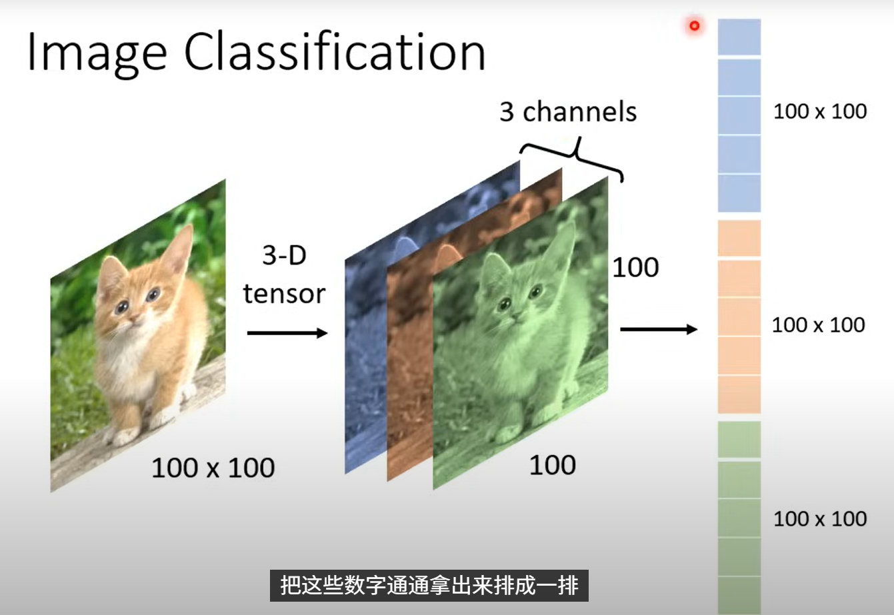

# cnn 的一些笔记

## 下面的图片说明了，图片可以看成一个 tenor，这里的话就是说一个三维的矩阵

## 然后这里的三个维度 长和宽 这反映的是图片的尺寸 然后 channel 这里是通道的意思，因为这是张彩色的图片，由三原色组成，然后这个矩阵存储的数字可以看成这种颜色的强度

## 这里的话，如果我用机器学习那里的多分类的思路（全连接层）去写的话会发现，我们的 w 权重太多了，我们假设第一个神经元主要去识别一个特征，那他里面的 w 是要和输入 x 的特征数量去匹配的，那这样其实是很浪费的

## 我们去识别的物体的时候也是通过去识别一些特征去判断，而神经网络也可以使用这种方法，神经元可以通过识别一些特征，再把识别的特征收集起来，再综合去判断，所以其实每个神经元它不需要都去看照片的每一个点，他们可以分工好，每个人看一部分就行了

## 于是基于上面的理解，我们就有一种想法，我们让一群神经元去看一块范围，这个范围内的特征由这群神经元去分析，有点类似于把图像的重要的信息提取出来看，不是每个点都去注意他

## 当然这个 receptive field 的大小维度位置不是固定，看你个人去定义也行

## 下面这张图片，告诉了我们，通过 kernel size 和 stride 去把图片进行了一个分割

## 这里引出了一个问题，不同的图片中，当这个鸟嘴出现在不同的位置的时候，如果我们要去识别出这个特征的话，我们需要在很多的地方去设置一个识别鸟嘴的神经元，如果我们再对这些神经元重复去计算每一个的参数的话这无疑是很浪费的一种行为

## 所以我们可以去让不同区域的神经元共享参数，因为不同区域的输入是不一样的，而鸟嘴的这个特征他的输出是固定的，只有输入满足预期才会输出想要的鸟嘴特征，所以共享参数完全可行

## 现在我们带入实际的运行模式

## 首先是卷积层干了什么事情：

### 卷积层是 CNN 的核心，负责从输入图像中提取局部特征（如边缘、纹理、角点等），这些特征是后续层（如全连接层）分类的基础。

### 而我们怎么去提取这个特征的呢？

### 就是利用 filter 我们用一个 3\*3 的矩阵，对我们的图像去扫描一遍，具体的怎么去扫描和设置的 stride 有关，而这个 filter 里的 w 和 b 是随机的，里面的参数是需要去学习的，所以可以认为一个 filter 就是一个特征的筛选器，他会去扫描图像的每个区域（这其实就是前面说的参数共享），由他扫描后输出的图像（这里说的图像侧重表达特征图，特征值高表达和这个 filter 匹配度高，可以这么理解吧），我们就可以看出原本的图像里哪个地方有这个特征，而卷积层就是用多个 filter 去扫描图片，然后我们就可以得到这个图片每个地方他具有的特征，比如说有的区域他有垂直线条和水平线条的特征，有的区域有点和折线的特征，而我们经过卷积层的图片的 channel 数就变成了我们的 filter 的数目了

### 其次就是池化层：

### 池化层做的事情其实就是在减少计算量，他在不丢失太多的图像信息（保留更重要的部分）下，去缩小图像的尺寸，当然我们也明白不是说一定要用池化层，我们也可以不去使用，主要明白这个池化层主要是为了加速运算
